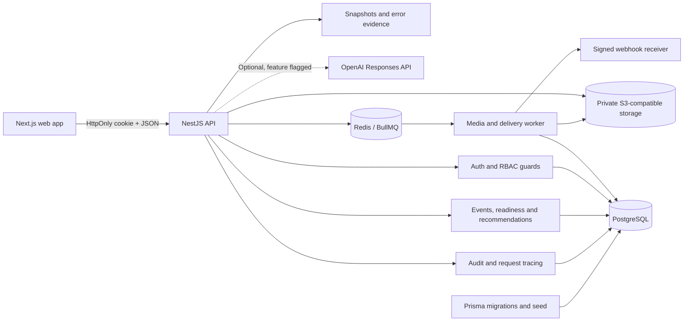

# OpsPilot

[](https://github.com/zhanru-dev/OpsPilot/actions/workflows/ci.yml)

OpsPilot is an English-first B2B operations platform for teams running complex online events. Its first vertical, **StreamOps**, turns fragmented event setup into an explainable launch-readiness workflow: accountable ownership, audience policy, critical runbooks, watch-page content, media state, recommendations and audit history in one control surface.

`v1.5.0` is the current release candidate. It keeps the verified v1.2 product scope and adds production configuration, independent deployable services and release smoke tests. The golden flow is database-backed, tenant-scoped, role-aware, asynchronous, measured, tested and documented.

## Product Thesis

> OpsPilot helps operations teams make complex online events launch-ready, execute them safely and leave an auditable record of every important decision.

The centrepiece is **Launch Control**. A versioned rules engine converts operational evidence into a score out of 100, distinguishes hard blockers from non-blocking gaps, and prevents invalid state transitions. Recommendations explain both the evidence and the suggested action.

## Platform Evidence

- Next.js 16, React 19, TypeScript and Tailwind CSS application.
- NestJS REST API with secure cookie sessions, token rotation and rate limiting.
- PostgreSQL and Prisma schema for users, workspaces, memberships, events and evidence.
- Workspace-scoped RBAC for operations managers and read-only analysts.
- Guarded `DRAFT -> CONFIGURING -> READY -> LIVE -> COMPLETED -> ARCHIVED` lifecycle.
- Archived-event immutability enforced by both the API and Launch Control.
- Versioned, deterministic readiness and recommendation engines.
- Optional grounded OpenAI recommendation provider behind a workspace feature flag.
- Strict structured output, evidence-key validation, persisted runs and explicit human confirmation.
- Deterministic fallback keeps the public demo complete without an API key.
- Editable event ownership and schedules, access policies, critical runbooks and watch-page content.
- Reversible ready-media attachment with readiness recalculation and audit evidence.
- Direct browser uploads through short-lived presigned URLs into private S3-compatible storage.
- ffprobe validation and FFmpeg video/audio derivatives in an independent BullMQ worker.
- Persisted processing jobs, progress, attempts, failure evidence and controlled retries.
- Short-lived private playback URLs plus scheduled demo-media retention cleanup.
- Transactional domain-event outbox with signed `event.ready` and `event.started` webhooks.
- Bounded webhook retries, duplicate suppression, attempt history, manual recovery and trace IDs.
- Integration Centre for endpoint subscriptions, delivery health and retry evidence.
- Persisted daily operational analytics, date ranges and CSV export.
- Browser/API error fingerprints, trace evidence and manager resolution.
- Public recruiter-readable `/case-study` route with a real product screenshot.
- Actor-attributed audit history and request IDs.
- OpenAPI 3.1 contract and local Swagger UI.
- Unit, API integration, tenant-isolation, RBAC, session-rotation, media and browser golden-flow tests.
- Responsive mobile list views, accessible focus-trapped dialogs and server-side audit search.
- Automated WCAG checks plus desktop and mobile visual verification.
- Zero known production dependency vulnerabilities at release verification.

## Architecture



See [Architecture](docs/architecture.md), [Threat Model](docs/threat-model.md), [Reliability Runbook](docs/runbooks/v1.1-media-and-webhooks.md), [v1.2 Release Evidence](docs/v1.2-release.md), [Quality Report](docs/evidence/v1.2-quality-report.md), [Narrated Demo](docs/evidence/opspilot-v1.2-demo.mp4), [Portfolio Case Study](docs/case-study.md) and the authoritative [Product Strategy](docs/product-strategy.md).

## Stack

| Layer      | Technology                                                                           |
| ---------- | ------------------------------------------------------------------------------------ |
| Web        | Next.js 16, React 19, Tailwind CSS 4, TanStack Query, React Hook Form, Zod, Recharts |
| API        | NestJS 11, TypeScript, class-validator, secure cookies, JWT and Argon2               |
| Data       | PostgreSQL 17, Prisma 6, Redis 7 and private S3-compatible object storage            |
| Quality    | ESLint, Jest, Supertest, Playwright and axe-core                                     |
| Operations | BullMQ workers, FFmpeg/ffprobe, health metrics, OpenAPI 3.1 and Docker Compose       |

## Local Setup

Requirements: Node.js 22+, npm 10+ and Docker Desktop.

```powershell
Copy-Item .env.example .env
npm install
npm run services:up
npm run db:generate
npm run db:deploy
npm run db:seed
npm run dev
```

| Surface       | URL                                       |
| ------------- | ----------------------------------------- |
| Web app       | `http://localhost:3000`                   |
| REST API      | `http://localhost:4100/api/v1`            |
| Swagger UI    | `http://localhost:4100/docs`              |
| OpenAPI JSON  | `http://localhost:4100/docs/openapi.json` |
| MinIO console | `http://localhost:9001`                   |

The API uses `4100` by default and remains configurable through the environment.

## Production Images

The v1.5 release candidate packages each long-running process independently from the monorepo root:

```powershell
npm run containers:build
```

| Image                   | Process                             | Runtime probe               |
| ----------------------- | ----------------------------------- | --------------------------- |
| `opspilot-api:local`    | `node apps/api/dist/main.js`        | `/api/v1/health/ready`      |
| `opspilot-worker:local` | `node apps/api/dist/worker.js`      | Process and queue telemetry |
| `opspilot-web:local`    | Next.js standalone server on `PORT` | `/login`                    |

The API image includes the Prisma CLI so a deployment can run `npm run db:deploy` from the exact release image before accepting traffic. Demo seeding is never automatic: in production, `npm run db:seed` refuses to run unless that one command explicitly receives `DEMO_SEED_ALLOWED=true`.

The Web image requires `NEXT_PUBLIC_API_URL` as a build argument because browser-visible Next.js variables are compiled into the client bundle. The API accepts either `API_PORT` or a platform-provided `PORT`, validates all required dependencies at startup, and supports cross-site secure cookies through `COOKIE_SECURE=true` and `COOKIE_SAME_SITE=none`.

A complete deployment uses separate API, worker and Web services with managed PostgreSQL, Redis and private S3-compatible storage. The worker has no public port. Production storage must exist before startup, use `S3_AUTO_CREATE_BUCKET=false`, and set `S3_FORCE_PATH_STYLE` to match the provider.

## Demo Accounts

The login page has one email/password flow. Its demo account shortcuts only fill the form; every account authenticates through the same endpoint and receives the role assigned to it in the database.

| Role               | User        | Capability                                                              |
| ------------------ | ----------- | ----------------------------------------------------------------------- |
| Operations Manager | Alex Morgan | Configure events, resolve blockers and transition launch state          |
| Audience Analyst   | Maya Chen   | Inspect readiness, recommendations and audit evidence in read-only mode |

Direct credential login is also available for API testing:

- `alex.morgan@opspilot.demo` / `DemoPass123!`
- `maya.chen@opspilot.demo` / `DemoPass123!`

These accounts are seed data only and must not be used outside local or isolated demo environments.

## Quality Commands

```powershell
npm run lint
npm run typecheck
npm run test
npm run test:e2e
npm run test:ui
npm run build
npm audit --omit=dev
```

The Playwright suite exercises the complete manager lifecycle through Archive, verifies analyst read-only boundaries, checks AI/analytics evidence, protects core pages from mobile overflow, and runs axe checks on key product surfaces.

## Readiness Model

| Criterion                  | Points | Hard blocker |
| -------------------------- | -----: | :----------: |
| Accountable owner          |     10 |     Yes      |
| Valid schedule             |     10 |     Yes      |
| Audience access policy     |     25 |     Yes      |
| Visible watch-page content |     15 |      No      |
| Ready media attached       |     15 |      No      |
| Critical runbook complete  |     25 |     Yes      |

Scores and evidence are calculated by the API. The UI does not decide whether a launch is allowed.

## Version Boundary

`v1.5.0` freezes the v1.2 product scope and adds reproducible production images, fail-fast environment validation, deployment security controls and public smoke-test automation. The release becomes final when the hosted Web, API, worker and managed dependencies pass the deployment gate. See the [v1.2 product release record](docs/v1.2-release.md) and [v1.5 deployment scope](docs/product-strategy.md#105-v15-public-deployment-and-release-operations).

- `v2`: HLS processing, live-session control, realtime updates, Portal Hub and advanced integration workflows.

## Clean-Room Boundary

OpsPilot is an original implementation informed by general enterprise livestream operations and the author's prior domain experience. It does not reuse proprietary source code, assets, branding, private data, credentials, captured API routes or copied screen layouts from another product.

Research materials and implementation artefacts are kept separate. The codebase expresses original domain names, contracts, visual design and behaviour. See [ADR 0001](docs/adr/0001-clean-room-product-boundary.md).

## Repository Layout

```text
apps/
  api/                 NestJS API and tests
  web/                 Next.js product UI
docs/
  adr/                 Architecture decisions
  architecture.md      System and domain design
  case-study.md        Portfolio narrative and interview evidence
  evidence/            Measured AI and release-quality evidence
  product-strategy.md  Scope and release roadmap
  threat-model.md      Security assumptions and mitigations
e2e/                   Playwright golden flow
prisma/                Schema, migration and deterministic seed
```
