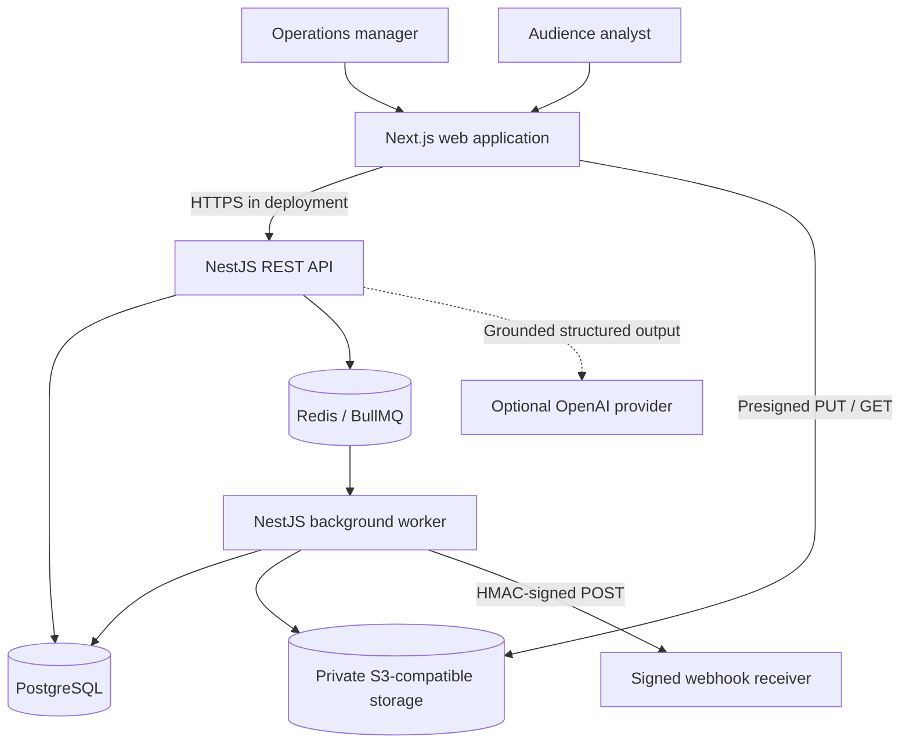
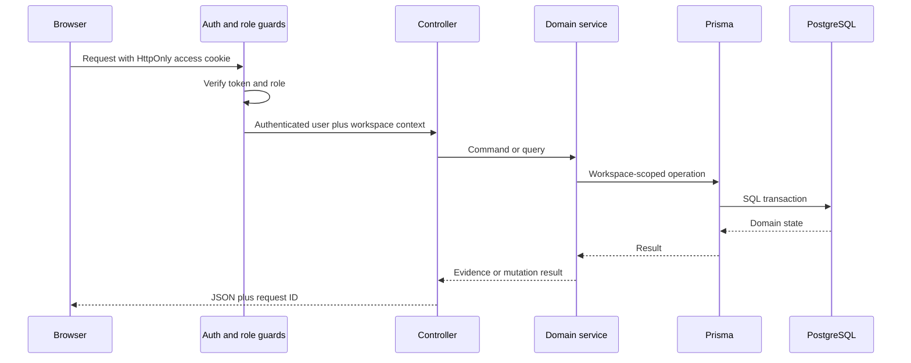
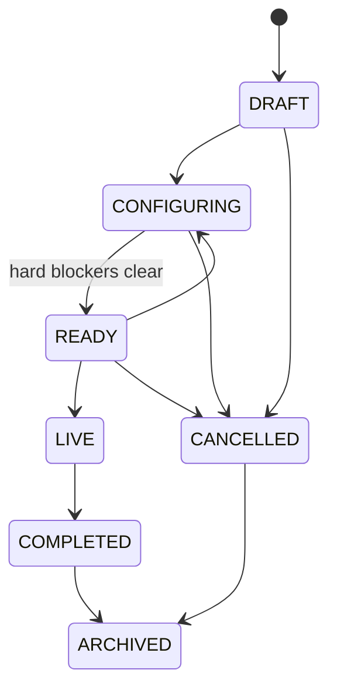

# OpsPilot v1.2 Architecture

## Purpose

This document describes the implemented v1.2 system, its trust boundaries and the decisions that make the portfolio claims inspectable. Future-state ideas belong in `product-strategy.md`; this file stays grounded in running code.

## System Context

The browser is untrusted. Every authorization decision, workspace boundary, state transition and readiness calculation is enforced by the API.

## Runtime Components

### Next.js Web

- App Router with an authenticated application shell.
- English-first, responsive operational UI.
- TanStack Query owns server state and targeted invalidation.
- Native URL parameters keep event filters shareable and refresh-safe.
- React Hook Form and Zod support structured client forms where appropriate.
- Role-aware affordances explain read-only behaviour, but are not the security boundary.
- Recharts renders a compact readiness distribution without owning business logic.

### NestJS API

- Global request validation strips unknown properties and rejects non-whitelisted input.
- Helmet adds browser security headers.
- A request ID is accepted or generated and returned for correlation.
- Global throttling limits accidental or malicious bursts.
- A global authentication guard verifies the access cookie.
- A second global guard evaluates route role metadata.
- Controllers remain thin around workspace-scoped Prisma queries and domain services.
- OpenAPI 3.1 is an explicit, reviewable contract served through Swagger UI.
- A global exception filter records unexpected API failures with request correlation.

### PostgreSQL and Prisma

- The SQL migration is versioned in the repository.
- Prisma models relational ownership instead of storing the event as one document.
- The deterministic seed creates stable roles, contrasting readiness states, media failures, recommendations and audit evidence.
- Daily analytics, recommendation runs, feature flags and error reports are persisted as workspace evidence.
- Transactions pair important domain mutations with their audit records.

### Redis and BullMQ

- Separate queues isolate media processing, outbox dispatch, webhook delivery and maintenance work.
- Persisted Prisma job records remain the product source of truth; Redis is the execution broker.
- Queue jobs use bounded attempts and exponential backoff, while processors remain idempotent against completed records.
- Worker startup recovers queued media records that are missing from Redis.

### Object Storage and Media Worker

- The browser uploads directly through a short-lived, content-type-bound presigned URL.
- The API validates workspace ownership, expected MIME type and exact object size before enqueueing work.
- ffprobe validates actual duration and codecs; FFmpeg creates one browser-playable preview and a video thumbnail.
- Source objects and derivatives remain private. Playback requires a fresh, short-lived signed GET URL.

### Integration Worker

- Event transitions write a domain event and outbox row in the same PostgreSQL transaction.
- The outbox dispatcher creates at most one delivery for each domain-event and endpoint pair.
- Delivery requests include an idempotency key, timestamp, trace ID and HMAC-SHA256 signature.
- Every attempt, response status, duration and safe error is persisted for the Integration Centre.

## Domain Model

```mermaid
erDiagram
    USER ||--o{ WORKSPACE_MEMBERSHIP : has
    WORKSPACE ||--o{ WORKSPACE_MEMBERSHIP : contains
    WORKSPACE ||--o{ STREAM_EVENT : owns
    WORKSPACE ||--o{ MEDIA_ASSET : owns
    STREAM_EVENT o|--|| ACCESS_POLICY : configures
    STREAM_EVENT ||--o{ RUNBOOK_ITEM : contains
    STREAM_EVENT ||--o{ CONTENT_BLOCK : presents
    STREAM_EVENT ||--o{ EVENT_MEDIA_ASSET : attaches
    MEDIA_ASSET ||--o{ EVENT_MEDIA_ASSET : supports
    STREAM_EVENT ||--o{ READINESS_ASSESSMENT : records
    STREAM_EVENT ||--o{ RECOMMENDATION : produces
    WORKSPACE ||--o{ AUDIT_LOG : records
    USER ||--o{ SESSION : authenticates
    WORKSPACE ||--o{ DOMAIN_EVENT : records
    DOMAIN_EVENT ||--o| OUTBOX_EVENT : publishes
    WORKSPACE ||--o{ WEBHOOK_ENDPOINT : owns
    WEBHOOK_ENDPOINT ||--o{ WEBHOOK_SUBSCRIPTION : subscribes
    DOMAIN_EVENT ||--o{ WEBHOOK_DELIVERY : delivers
    WEBHOOK_DELIVERY ||--o{ WEBHOOK_DELIVERY_ATTEMPT : attempts
    MEDIA_ASSET ||--o{ MEDIA_UPLOAD : receives
    MEDIA_ASSET ||--o{ MEDIA_PROCESSING_JOB : processes
    MEDIA_PROCESSING_JOB ||--o{ MEDIA_PROCESSING_ATTEMPT : attempts
    MEDIA_ASSET ||--o{ MEDIA_VARIANT : creates
    WORKSPACE ||--o{ ANALYTICS_SNAPSHOT : measures
    WORKSPACE ||--o{ FEATURE_FLAG : configures
    STREAM_EVENT ||--o{ RECOMMENDATION_RUN : evaluates
    WORKSPACE ||--o{ ERROR_REPORT : captures
```

## Request Flow

## Authentication and Session Rotation

1. Login verifies an Argon2 password hash for a seeded or user-created account.
2. The API creates a server-side `Session` and stores only an Argon2 hash of its refresh token.
3. The browser receives short-lived access and longer-lived refresh JWTs in HttpOnly, SameSite=Lax cookies.
4. Refresh verifies both JWT signature and stored hash, then rotates the token hash and expiry on the same server-side session.
5. Logout revokes the current server-side session and clears both cookies.

Access JWT claims contain the selected workspace and role for the current portfolio scope. Membership is resolved during login, and all domain queries still include `workspaceId`.

## Tenant Isolation

Tenant isolation is a query invariant:

- Collection queries filter by `user.workspaceId`.
- Detail mutations first locate the entity through its workspace or an owning event.
- Cross-workspace detail requests return 404, avoiding resource enumeration.
- Media attachment verifies both event and asset in the same workspace.
- Audit queries are scoped independently rather than trusting an event parameter.

The API integration suite creates a second workspace and confirms that an authenticated user cannot retrieve its valid event ID.

## Launch State Machine

The frontend presents `Start configuring` for a draft and `Mark ready` for a configuring event. The API remains authoritative and rejects illegal transitions.

## Readiness Engine

The v1 rule set is deliberately deterministic:

| Evidence                                           | Weight | Blocking behaviour |
| -------------------------------------------------- | -----: | ------------------ |
| Owner exists                                       |     10 | Hard blocker       |
| End follows start                                  |     10 | Hard blocker       |
| Access policy exists                               |     25 | Hard blocker       |
| Visible content exists                             |     15 | Score gap only     |
| Ready media is attached                            |     15 | Score gap only     |
| At least one critical task exists and all are done |     25 | Hard blocker       |

Each response contains criterion-level evidence, blocker text, score, status, rule version and assessment time. Mutating evidence persists a `ReadinessAssessment` snapshot. This supports explainability today and comparison between rule versions later.

## Recommendations and AI Assurance

Deterministic recommendations remain authoritative. Each recommendation includes:

- stable rule key and version;
- severity and workflow status;
- evidence captured as JSON;
- human-readable explanation;
- suggested action;
- resolver and timestamp when completed.

v1.2 adds an optional OpenAI provider behind the workspace `AI_RECOMMENDATIONS` flag. The API sends only a bounded event/readiness snapshot, requests strict structured output, and validates supported fields, unique keys and evidence references again before persistence. A valid proposal remains `AWAITING_CONFIRMATION` until a manager confirms or rejects it.

Provider absence, refusal, invalid output, HTTP failure or timeout produces a persisted deterministic fallback. No model output can change the readiness score or event state.

## Analytics Snapshots

One workspace-scoped daily row captures readiness distribution, media and webhook outcomes, recommendation activity, and browser/API failures. The analytics service derives KPI percentages and 7/14/30-day series from these rows. Managers can refresh today's row; all authenticated workspace roles can export the same persisted range as CSV.

## Media Pipeline

The v1.1 media boundary is deliberately bounded:

1. A manager requests an upload intent for an allow-listed MP4, MOV, MP3, WAV or M4A profile up to 100 MB.
2. The browser sends the bytes directly to private object storage before the ten-minute URL expires.
3. Completion checks the object size and declared MIME type, creates a persisted processing job and publishes one BullMQ job.
4. The worker downloads to an isolated temporary directory, probes actual streams and rejects unsupported codecs or content over five minutes.
5. FFmpeg creates an H.264/AAC MP4 plus JPEG thumbnail for video, or an MP3 derivative for audio.
6. A database transaction records variants, attempt evidence, audit history and a domain event before attached event readiness is recalculated.
7. A scheduled maintenance queue expires incomplete uploads and non-seeded demo media after the configured retention window.

Adaptive streaming, live ingest, DRM, antivirus scanning and multi-region delivery remain outside v1.1.

## Reliable Webhooks

`READY` and `LIVE` event transitions emit `event.ready` and `event.started`. The transactional outbox prevents a committed transition from losing its integration event. A uniqueness constraint on `(domainEventId, endpointId)` suppresses duplicate deliveries. Receivers can also deduplicate with the stable event ID sent as `idempotency-key`.

The local receiver supports deterministic success and fail-once modes. It verifies the timestamp replay window and signature before responding. Production endpoints must be allow-listed or protected against SSRF before arbitrary URLs are accepted; v1.1 intentionally creates only the safe local demo receiver.

## Observability

Implemented:

- liveness plus database, Redis queue and object-storage readiness;
- authenticated queue depth and persisted outbox/webhook failure counters;
- request IDs on API responses and trace IDs on domain events and deliveries;
- structured JSON records for media completion/failure, outbox errors and webhook attempts;
- append-only audit history, persisted processing attempts and delivery evidence.
- persisted recommendation-provider/fallback runs and browser/API error fingerprints;
- analytics reliability counters and manager error-resolution evidence.

Hosted environments should export these signals to a metrics and error-monitoring provider, set alert thresholds and carry a W3C trace context through every service boundary.

## Test Strategy

| Layer                  | What it protects                                                         |
| ---------------------- | ------------------------------------------------------------------------ |
| TypeScript and ESLint  | Contract drift, unsafe access and framework misuse                       |
| Domain unit tests      | Readiness, media validation, signatures, outbox and AI output boundaries |
| Supertest integration  | Auth, RBAC, isolation, analytics, fallback and error triage              |
| Playwright golden flow | Manager journey, analyst boundary, reliability, analytics and mobile UI  |
| axe-core               | Serious and critical WCAG violations on key workflow states              |
| Visual review          | Desktop and mobile layout, overflow, navigation and content hierarchy    |

## Deployment Shape

The local environment runs PostgreSQL, Redis and MinIO in Docker, with web, API and worker processes on the host. A hosted deployment should use managed PostgreSQL, Redis and private S3-compatible storage, and run the API and worker as separate services behind TLS. Production must supply secret-manager values, strict origins, secure cookies, storage lifecycle policies and an SSRF-safe webhook endpoint policy.
