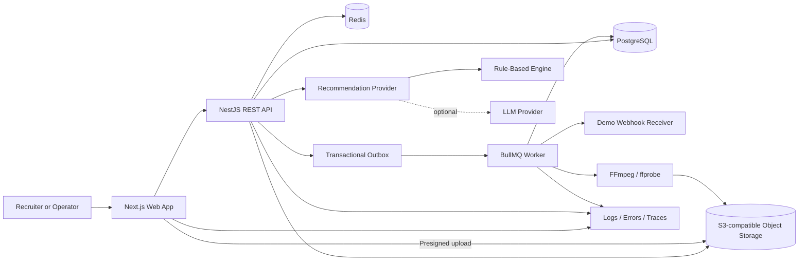

# OpsPilot + StreamOps Product and Portfolio Strategy

> Status: authoritative product decision and delivery plan
>
> Version: 2.0
>
> Updated: 2026-08-13
>
> Purpose: define one original, English-first portfolio product that combines the strongest OpsPilot ideas with clean-room evidence from enterprise livestream operations, and turns the implementation into credible proof for UK frontend, full-stack and product-engineering roles.
>
> Implementation status: v1.2 completed and verified locally. See `v1.2-release.md` for acceptance evidence; v2.0 remains roadmap scope.

## 1. Executive Decision

Build one product:

> **OpsPilot helps operations teams make complex online events launch-ready, execute them safely, and leave an auditable record of every important decision.**

`OpsPilot` is the platform and product brand. `StreamOps` is its first complete vertical module for livestream and online-event operations.

The product should not be presented as a Mudu rebuild or clone. It is an original clean-room system informed by real enterprise workflows: event setup, audience access, media operations, configurable experiences, analytics, permissions and operational controls.

The strongest portfolio story is no longer "I built a large admin dashboard." It is:

> I translated an operationally complex legacy domain into an original full-stack product, modelled its business rules, built a reliable end-to-end workflow, and supplied evidence that the system is secure, testable, observable and deployable.

### 1.1 What Changed In Version 2.0

This review keeps the earlier integration decision but sharpens the product and engineering priorities.

| Earlier direction                     | Version 2.0 decision                                                                              |
| ------------------------------------- | ------------------------------------------------------------------------------------------------- |
| Broad AI-assisted operations platform | Lead with launch readiness and operational control; AI supports the workflow                      |
| Event detail as one of many pages     | Make `Launch Control` the centrepiece of the product                                              |
| Large set of Mudu-inspired modules    | Keep only modules that strengthen the core workflow or the user's work story                      |
| Automation skeleton                   | Build one real asynchronous workflow with retries and idempotency                                 |
| Swagger and tests as supporting tasks | Make contracts, tests, security, observability and CI part of the product definition              |
| Rule-based recommendations only       | Keep deterministic rules, add an optional grounded LLM provider and an evaluation set             |
| README and screenshots                | Add a public case study, architecture decisions, measured quality evidence and a short demo video |
| Portal Hub in early scope             | Move Portal Hub behind Integration Centre and production-quality engineering work                 |
| Mock-only Media Library               | Keep media operations in v1.0 and add a real, bounded audio/video pipeline in v1.1                |

### 1.2 Authoritative Scope Rule

This document is the main product strategy. If older OpsPilot or Mudu planning documents conflict with it, this document takes precedence for product scope and build order. Older documents remain useful as research, historical planning and interview preparation.

## 2. Portfolio Thesis

### 2.1 Target Roles

Primary targets:

- Full-Stack TypeScript Engineer.
- Product Engineer.
- Senior Frontend Engineer with strong API and product ownership.

Secondary targets:

- Frontend Platform Engineer.
- Node.js / NestJS Backend Engineer.
- SaaS Application Engineer.

### 2.2 What The Project Must Prove

| Hiring signal           | Evidence OpsPilot must provide                                                             |
| ----------------------- | ------------------------------------------------------------------------------------------ |
| Product judgment        | A focused operational problem, deliberate scope and clear user outcomes                    |
| Senior frontend ability | Dense workflow UI, complex forms, URL state, accessibility, failure states and performance |
| Full-stack ownership    | Next.js UI, NestJS API, relational modelling, transactions, authentication and deployment  |
| Backend depth           | Tenant isolation, business rules, background jobs, idempotency and API contracts           |
| Reliability mindset     | Structured logs, trace IDs, health checks, retries, failure visibility and runbooks        |
| Security awareness      | Secure cookies, RBAC, workspace scoping, validation, rate limiting and threat notes        |
| AI literacy             | Grounded structured outputs, fallback behaviour, evaluation cases and human approval       |
| Communication           | ADRs, architecture diagram, case study, API docs and concise trade-off explanations        |
| Delivery discipline     | CI, database migrations, seed/reset workflow, tests and a stable public demo               |

The codebase should make these claims inspectable. A recruiter should not have to trust adjectives such as "production-ready" or "scalable" without supporting artefacts.

### 2.3 Current Market Calibration

This is a directional sample, not a claim about every UK vacancy. Roles reviewed in August 2026 repeatedly valued:

- End-to-end TypeScript, React/Next.js, Node.js and PostgreSQL ownership.
- API and data-model design, tests and migration discipline.
- CI/CD, cloud deployment, monitoring and observability.
- Background jobs, event-driven systems, queues, integrations and reliable workflows.
- Product thinking and the ability to explain technical trade-offs.
- Applied AI that is operated and evaluated, rather than a decorative chatbot.

Sources reviewed:

- [Skills England software developer occupational standard](https://skillsengland.education.gov.uk/occupations/OCC0116-v1-2)
- [Fluency - Software Engineer, Product](https://jobs.ashbyhq.com/fluency/8cdfa269-ddd4-44e8-b440-b36c9455769c)
- [Ravio - Senior Software Engineer, London](https://jobs.ashbyhq.com/ravio/3a2edc1a-fe5e-49ba-8c76-d453212632dd)
- [Multiverse - Senior Engineering Manager, London](https://jobs.ashbyhq.com/multiverse/764fa366-dbe2-4f04-ae55-908651d4c771)
- [Nous - Product Engineer, London](https://jobs.ashbyhq.com/nous/e27f51d9-c782-4d6e-963d-eeeb073236c0)

The implication is important: another polished CRUD dashboard is not enough. OpsPilot needs one deep workflow plus visible engineering maturity.

## 3. Evidence Review

### 3.1 OpsPilot Strengths

The existing OpsPilot documents already contain a strong product spine:

- Event readiness scoring.
- Audience access rules.
- Content modules.
- Operational recommendations.
- Analytics.
- Audit logs.
- Workspace roles.

These ideas are more differentiated than a generic event-booking application because they describe an operator's decisions before, during and after an event.

### 3.2 OpsPilot Gaps

The earlier plan was still vulnerable in several areas:

- Too many pages could be built without one memorable centrepiece.
- The backend could still look like CRUD around seeded records.
- "AI-assisted" could sound superficial without grounding and evaluation.
- Deployment, security, observability and performance were listed but not treated as acceptance criteria.
- The connection to previous work existed in prose but was not mapped to inspectable product decisions.
- The portfolio package did not yet provide a public case study or evidence-based claims.

Version 2.0 directly addresses these gaps.

### 3.3 StreamOps Evidence

The authorised analysis of `https://mudu.tv/console-v2` established credible domain breadth without requiring source-code reuse:

| Evidence                                         | Observed result |
| ------------------------------------------------ | --------------: |
| Public routes                                    |             160 |
| Public assets                                    |             370 |
| Browser-delivered JS chunks scanned for metadata |             215 |
| Raw URL/API candidates                           |             462 |
| Backend-like API candidates                      |             215 |
| Logged-in pages visited for shape capture        |              11 |
| Unique non-OPTIONS API endpoints observed        |              17 |

The most useful domain signals were:

- User, account and permission context.
- Channel/event lists, categories and tags.
- Audience access workflows.
- Media library and resource usage.
- Portal and configurable content.
- Audience profiles and analytics.
- Notifications, feature flags and application modules.
- API token and callback concepts from the wider product documentation.

These signals justify the StreamOps domain model. They do not dictate our routes, code, UI or database design.

### 3.4 Clean-Room Boundary

Allowed as product evidence:

- Observed workflows and domain concepts.
- Route groupings and endpoint families.
- Query-key names and anonymised response shapes.
- Generic enterprise UI patterns.
- Lessons from the user's own previous work.

Not allowed in OpsPilot implementation:

- Original JS implementation or React components.
- Original CSS, Ant Design configuration or layout code.
- Original images, icons, logos, branding or copy.
- Customer data, credentials, tokens, cookies or private values.
- One-to-one route, endpoint or information-architecture reproduction.

Implementation rule:

> Use the captured material to understand the problem domain. Design every OpsPilot screen, contract, model and interaction from first principles.

## 4. Product Definition

### 4.1 Problem

Online events fail operationally when configuration is distributed across access settings, content, media, ownership, integrations and timing. Operators need to know:

- What is ready?
- What is blocking launch?
- Who changed what?
- Which downstream integrations succeeded or failed?
- What action should be taken next?

### 4.2 Core Job To Be Done

> When I am preparing an important online event, help me identify and resolve launch risks before they become audience-facing failures, then give me a reliable record of the outcome.

### 4.3 Primary Personas

| Persona                  | Main need                                 | Role in demo         |
| ------------------------ | ----------------------------------------- | -------------------- |
| Operations Manager       | Own launch readiness and resolve blockers | Primary user         |
| Content / Media Operator | Prepare event content and media assets    | Contributor          |
| Analyst                  | Review audience and event performance     | Read-only specialist |
| Workspace Admin          | Manage members, policies and integrations | Governance owner     |

### 4.4 Platform And Vertical Split

| OpsPilot platform capability | StreamOps implementation                          |
| ---------------------------- | ------------------------------------------------- |
| Workspace and identity       | Multi-tenant event operations workspace           |
| Policy and permissions       | Event access policies and role-aware actions      |
| Readiness engine             | Stream-event launch score, blockers and criteria  |
| Operational runbooks         | Event setup checklist and ownership               |
| Recommendations              | Explainable event-risk recommendations            |
| Integrations                 | Event webhooks and delivery history               |
| Auditability                 | Append-only activity history across event changes |
| Analytics                    | Attendance, engagement and completion summaries   |
| AI provider layer            | Grounded explanation and action drafting          |

This is a genuine integration: OpsPilot provides reusable operational primitives, while StreamOps supplies the first real domain in which they are proven.

## 5. Product Architecture

Recommended information architecture:

```text
OpsPilot
  Overview
  StreamOps
    Events
    Launch Control
    Media Library
    Analytics
  Integrations
  Audit Logs
  Workspace Settings
```

`Recommendations` and `Runbook` belong inside Launch Control in v1.0. They should not become disconnected top-level pages. A global AI chat page is also unnecessary in the first version.

### 5.1 Main Product Surfaces

| Surface               | User value                                | Engineering evidence                                          | Planned release             |
| --------------------- | ----------------------------------------- | ------------------------------------------------------------- | --------------------------- |
| Overview              | See risk across all upcoming events       | Aggregation API, charts, filters, loading/error states        | v1.0                        |
| Event list            | Find and triage work                      | URL-backed filters, pagination, permissions                   | v1.0                        |
| Launch Control        | Understand and resolve readiness blockers | State machine, derived rules, optimistic updates, audit trail | v1.0                        |
| Access Policy Builder | Define who can watch and explain the rule | Conditional forms, validation, policy modelling               | v1.0                        |
| Content and Media     | Attach launch-critical assets             | Relational data, processing states, bulk/list UI              | v1.0; real pipeline in v1.1 |
| Recommendations       | Explain risks and suggest next actions    | Deterministic rules, evidence and resolution                  | v1.0; LLM provider in v1.2  |
| Audit Logs            | Prove who changed what and when           | Transactional mutation logging, searchable timeline           | v1.0                        |
| Integration Centre    | Inspect webhook health and retry failures | Outbox, queue, idempotency, retries, observability            | v1.1                        |
| Analytics             | Review operational and audience outcomes  | Aggregated snapshots, charts and date ranges                  | v1.2                        |
| Portal Hub            | Configure a public content destination    | Config editor and preview                                     | v2.0                        |
| Engagement Apps       | Polls, Q&A and feedback                   | Realtime or event-driven UI                                   | v2.0                        |

### 5.2 Launch Control: The Centrepiece

Launch Control replaces a generic event-detail page as the product's most memorable screen.

It should contain:

- Event status and next transition.
- Readiness score with hard blockers and weighted warnings.
- Runbook checklist with owner and due time.
- Access-policy summary.
- Content and media status.
- Integration health.
- Explainable recommendations.
- Recent activity timeline.
- A `Mark Ready` or `Start Event` action that is disabled while hard blockers remain.

This page demonstrates frontend composition, backend rules, permissions and operational product thinking in one place.

### 5.3 Event State Machine

```text
DRAFT -> CONFIGURING -> READY -> LIVE -> COMPLETED -> ARCHIVED
                       \-> CANCELLED
```

Rules:

- Only allowed transitions are accepted by the API.
- `READY` requires zero hard blockers.
- Starting an event requires the `event:operate` permission.
- Every transition records an audit event.
- Repeated transition requests use an idempotency key.
- A successful transition emits a domain event for integrations.

### 5.4 Readiness Model

Readiness must be explainable, not a decorative percentage.

Example criteria:

| Criterion                         | Weight | Hard blocker |
| --------------------------------- | -----: | ------------ |
| Event owner assigned              |     10 | Yes          |
| Valid schedule and timezone       |     10 | Yes          |
| Access policy configured          |     20 | Yes          |
| Watch-page content present        |     15 | No           |
| Required media asset ready        |     15 | No           |
| Runbook critical tasks complete   |     20 | Yes          |
| Required webhook endpoint healthy |     10 | No           |

The API returns score, criterion results, evidence and blocking reasons. The UI never reimplements the score independently.

## 6. Golden Demo

The public demo should be understandable in six to eight minutes.

```text
One-click demo login
  -> Overview shows one high-risk launch
  -> Open Launch Control
  -> Inspect two evidence-backed blockers
  -> Configure the missing audience access policy
  -> Attach a ready media asset and complete a runbook task
  -> Readiness recalculates and the launch gate opens
  -> Approve a suggested action
  -> Domain event is queued and webhook delivery succeeds or retries
  -> Audit timeline shows the complete chain of actions
```

Required seeded scenario:

- `Global Product Briefing` starts soon and has a low readiness score.
- The event is missing a valid access policy and one critical runbook task.
- A media asset is available but not attached.
- One integration delivery has failed once and is eligible for retry.
- An Operations Manager can resolve the workflow.
- An Analyst account can see the same event but cannot mutate it.

The demo must use database-backed data. No core chart, score or recommendation should be hardcoded inside a React component.

The v1.1 extended demo adds a bounded real-media path:

```text
Upload a short audio or video file
  -> Browser uploads directly to S3-compatible storage
  -> Media asset enters PROCESSING
  -> Worker extracts metadata and creates a preview derivative
  -> Asset becomes READY or exposes a retryable failure
  -> Attach the asset to the event
  -> Launch readiness and audit history update
```

## 7. High-Value Engineering Additions

### 7.1 Multi-Tenant Authorisation

This is essential for a credible B2B SaaS project.

- A user may belong to more than one workspace.
- Role belongs to `WorkspaceMembership`, not directly to `User`.
- Every workspace-owned query is scoped server-side.
- Permission checks exist in both UI and API, with the API as authority.
- Cross-tenant access attempts are covered by integration tests.
- Demo accounts visibly show different roles and allowed actions.

Recommended roles:

```text
ADMIN
OPERATIONS_MANAGER
CONTENT_OPERATOR
ANALYST
VIEWER
```

### 7.2 Integration Centre And Reliable Webhooks

This is one of the highest-value additions missing from the earlier plan. It connects the original product's API/callback concepts with current backend hiring signals.

The v1.1 scope is deliberately narrow:

- Create one webhook endpoint using a safe demo receiver.
- Subscribe it to `event.ready` and `event.started`.
- Write a domain event and outbox record in the same database transaction as the business mutation.
- Deliver the event through a background worker.
- Retry transient failures with bounded exponential backoff.
- Use a stable event ID as the idempotency key.
- Display attempt count, response status, next retry and trace ID.
- Allow an authorised manual retry.

This one vertical slice proves queues, failure handling, transactions and observability without turning OpsPilot into an integration platform.

### 7.3 Bounded Audio/Video Media Pipeline

Media operations are part of the user's strongest previous-work story, so they must not remain a decorative or permanently mocked feature. The project will add one real vertical media pipeline in v1.1 while continuing to exclude full livestream infrastructure.

Supported v1.1 flow:

```text
Create upload intent
  -> Receive a short-lived presigned URL
  -> Upload directly to S3-compatible object storage
  -> Confirm upload and enqueue processing
  -> Validate the object and inspect it with ffprobe
  -> Generate metadata and a safe web preview with FFmpeg
  -> Persist READY or FAILED state
  -> Preview, retry or attach the asset to a Stream Event
```

Supported media types:

- Short video files for event intros, replay samples or supporting content.
- Short audio files for event audio, podcast-like assets or accessibility alternatives.
- Seeded assets remain available so the public demo never depends on a user upload.

Required implementation details:

- Local development uses MinIO; production uses an S3-compatible provider.
- Browser uploads do not pass through the Next.js or NestJS process.
- Upload intents enforce workspace, MIME allow-list, size and expiry constraints.
- Server-side validation checks actual file type instead of trusting the browser extension.
- Media state is explicit: `PENDING_UPLOAD`, `UPLOADING`, `PROCESSING`, `READY`, `FAILED`, `DELETED`.
- The worker uses `ffprobe` to extract duration, dimensions, codecs and container metadata.
- FFmpeg generates a video thumbnail and a bounded web-playable preview derivative; audio receives normalised metadata and a browser-playable derivative when needed.
- Processing is idempotent and safe to retry.
- Original and derived objects use private storage with short-lived playback URLs.
- Processing progress, failure reason and retry history are visible in the UI.
- Completion and failure create audit records and domain events.
- A `READY` asset can be attached to an event and contribute to launch readiness.

Public-demo guardrails:

- Cap file size and duration.
- Rate-limit upload intents and processing retries.
- Use a small supported-codec matrix.
- Delete demo uploads on a schedule.
- Keep seeded assets as the guaranteed golden-demo path.

Deferred media capabilities are listed under v2.0. The v1.1 pipeline demonstrates real engineering without claiming to be a video cloud.

### 7.4 Observable By Default

Minimum production evidence:

- Structured JSON logs.
- Request and trace IDs propagated from web to API and worker.
- `/health/live` and `/health/ready` endpoints.
- Error capture with sensitive-field redaction.
- Queue depth and webhook success/failure counters.
- Slow-query visibility.
- A small operational runbook: how to diagnose a failed webhook or unavailable database.

OpenTelemetry is preferred for vendor-neutral traces and metrics. Sentry can be added for frontend and backend error reporting if deployment budget allows.

### 7.5 Security As A Feature

Required controls:

- Short-lived access token and rotated refresh token in `HttpOnly`, `Secure`, `SameSite` cookies.
- Password hashing with Argon2 or bcrypt using a documented cost.
- Strict DTO validation and unknown-field rejection.
- CORS allow-list, Helmet and rate limiting.
- CSRF protection for cookie-authenticated mutations.
- Workspace-scoped authorisation on every protected resource.
- Hashed webhook secrets and signed outbound webhook payloads.
- Private object storage, short-lived upload/playback URLs and server-side media validation.
- No tokens or personal data in logs, seeds or screenshots.
- Dependency and secret scanning in CI.
- A concise threat model covering tenant isolation, auth, webhook SSRF and replay attacks.

The app should never claim formal compliance such as SOC 2 or ISO 27001. It should state which engineering controls were implemented.

### 7.6 AI With Evidence, Not Theatre

The public demo should remain reliable without paid model access.

```text
RecommendationProvider
  RuleBasedRecommendationProvider   # public-demo default
  LlmRecommendationProvider         # enabled by environment variable
```

Every recommendation should contain:

- Severity.
- Summary.
- Evidence fields from the current event.
- Suggested action.
- Confidence or applicability reason.
- Provider and rule/prompt version.
- Creation and resolution timestamps.

LLM rules:

- Send only the minimum structured event context.
- Require schema-validated structured output.
- Do not let the model mutate data directly.
- Show an action preview and require user confirmation.
- Fall back to deterministic rules on timeout, invalid output or provider failure.
- Maintain a small evaluation dataset with expected severity and action categories.
- Record latency and approximate token/cost metadata when the LLM provider is enabled.

An optional later differentiator is a read-only OpsPilot MCP server with tools such as `list_at_risk_events` and `explain_readiness`. It is P2 until the product and API are complete.

### 7.7 Accessibility And Frontend Quality

Required frontend signals:

- Keyboard-accessible navigation, dialogs, menus and forms.
- Visible focus states and semantic labels.
- Colour is never the only readiness or severity signal.
- Table alternatives or responsive list layouts for narrow screens.
- URL-backed search, filters, sorting and pagination.
- Clear loading, empty, error, stale and permission-denied states.
- Form validation that connects field errors to inputs.
- Optimistic updates only where rollback behaviour is clear.
- Axe checks on the main workflow and manual keyboard testing.
- No critical or serious accessibility violations in the golden flow.

### 7.8 Performance And Data Discipline

Required evidence:

- PostgreSQL indexes justified by actual list and audit queries.
- Pagination on events, media assets, audit logs and webhook deliveries.
- Query-count inspection to avoid N+1 behaviour.
- A documented `EXPLAIN ANALYZE` example for one important query.
- Next.js bundle and image discipline.
- Lighthouse runs on the main demo routes.
- A small k6 or equivalent API load scenario with environment and dataset documented.

Performance numbers should be reported only after measurement. Targets are not CV claims.

## 8. System Architecture



### 8.1 Recommended Stack

```text
Frontend
  Next.js App Router
  React + TypeScript
  Tailwind CSS
  TanStack Query
  React Hook Form + Zod
  Recharts
  Lucide React

Backend
  NestJS
  Prisma
  PostgreSQL
  Redis + BullMQ
  S3-compatible object storage
  MinIO for local development
  FFmpeg + ffprobe
  OpenAPI / Swagger
  OpenTelemetry

Quality
  Vitest or Jest
  React Testing Library
  Supertest
  Playwright
  axe-core
  k6
  GitHub Actions
  Docker Compose
```

Use the repository's selected package manager consistently. Do not add Kubernetes, Terraform or microservices to any v1.x release merely to list them on a CV.

### 8.2 Repository Shape

```text
apps/
  web/
  api/
  worker/
packages/
  api-client/
  contracts/
  config/
prisma/
docs/
  adr/
  architecture/
  case-study/
  runbooks/
```

The worker may begin inside the NestJS repository if a third deployable app creates unnecessary deployment complexity. The important part is a clear queue boundary and testable job handler.

### 8.3 Core Domain Models

Platform:

```text
User
Session
Workspace
WorkspaceMembership
AuditLog
FeatureFlag
```

StreamOps:

```text
StreamEvent
EventCategory
EventTag
RunbookItem
ReadinessAssessment
AccessPolicy
ContentBlock
MediaAsset
EventMediaAsset
MediaUpload
MediaProcessingJob
MediaVariant
AnalyticsSnapshot
AudienceProfile
Recommendation
```

Integration and reliability:

```text
DomainEvent
OutboxEvent
WebhookEndpoint
WebhookSubscription
WebhookDelivery
Notification
```

Important modelling decisions:

- Membership owns the workspace role.
- `ReadinessAssessment` stores an immutable snapshot and rule version so historical scores are explainable.
- `AccessPolicy` is a real policy model, not a free-text field.
- `ContentBlock.metadata` may use validated JSON for a small known set of block types.
- Media upload, processing and derived variants have separate records so retries do not overwrite asset history.
- Media processing status uses an explicit state machine and a versioned processing profile.
- Original objects and media variants remain private; the API issues short-lived upload and playback URLs.
- `AuditLog` is append-only in normal application flows.
- Domain and outbox records are written transactionally.
- Webhook deliveries have a unique event/endpoint constraint to suppress duplicates.

### 8.4 API Contract Principles

- Use original, versioned routes under `/api/v1`.
- Generate OpenAPI from NestJS DTOs.
- Generate or validate the frontend API client from the contract.
- Use consistent pagination and filtering conventions.
- Return RFC 9457-style problem details for errors, including a trace ID.
- Use `Idempotency-Key` for event transitions and manual webhook retries where appropriate.
- Never reproduce original Mudu endpoint paths.

Representative endpoints:

```text
POST   /api/v1/auth/login
POST   /api/v1/auth/refresh
GET    /api/v1/me
GET    /api/v1/workspaces/current

GET    /api/v1/stream-events
POST   /api/v1/stream-events
GET    /api/v1/stream-events/:id
PATCH  /api/v1/stream-events/:id
POST   /api/v1/stream-events/:id/transitions
GET    /api/v1/stream-events/:id/readiness

GET    /api/v1/stream-events/:id/access-policy
PUT    /api/v1/stream-events/:id/access-policy
GET    /api/v1/stream-events/:id/runbook
PATCH  /api/v1/runbook-items/:id

GET    /api/v1/media-assets
GET    /api/v1/media-assets/:id
POST   /api/v1/media-assets/uploads
POST   /api/v1/media-assets/uploads/:id/complete
POST   /api/v1/media-assets/:id/retry-processing
POST   /api/v1/media-assets/:id/playback-url
POST   /api/v1/stream-events/:id/media-assets

GET    /api/v1/stream-events/:id/recommendations
POST   /api/v1/stream-events/:id/recommendations/generate
POST   /api/v1/recommendations/:id/resolve

GET    /api/v1/webhook-endpoints
POST   /api/v1/webhook-endpoints
GET    /api/v1/webhook-deliveries
POST   /api/v1/webhook-deliveries/:id/retry

GET    /api/v1/audit-logs
GET    /api/v1/stream-events/:id/audit-logs
```

## 9. Testing Strategy

Tests should follow business risk, not a vanity coverage percentage.

### 9.1 Unit Tests

- Readiness criteria and score calculation.
- Event transition rules.
- Access-policy validation.
- Recommendation rules.
- Webhook signature generation.
- Retry classification and backoff calculation.
- Media upload constraints and processing-state transitions.
- Idempotent media processing decisions.

### 9.2 Integration Tests

- Login, refresh and logout.
- Workspace tenant isolation.
- Role and permission enforcement.
- Transactional event mutation plus audit/outbox creation.
- Idempotent event transitions.
- Webhook duplicate suppression and retry state.
- Upload-intent workspace scoping and expiry.
- Media completion, processing-job creation and retry history.
- Prisma queries against PostgreSQL, not only mocked repositories.

### 9.3 End-To-End Tests

- One-click demo login.
- Golden Launch Control workflow.
- Analyst cannot perform an Operations Manager action.
- Failed webhook can be inspected and retried.
- A bounded sample upload reaches `READY`, can be previewed and can be attached to an event.
- A controlled media-processing failure can be retried without creating duplicate variants.
- Main workflow passes accessibility checks.

### 9.4 Contract And Quality Gates

- OpenAPI generation produces no uncommitted contract drift.
- Type check, lint, unit and integration suites pass in CI.
- Database migration runs against a clean test database.
- Playwright smoke test runs against the deployed preview or production-like environment.
- Dependency and secret scanning report no unresolved critical finding.

## 10. Scope

### 10.1 Release Policy

The product should be released in small, named versions. A later version may deepen a feature but must not make an earlier public demo unusable.

| Release | Purpose                                                          | Application status                     |
| ------- | ---------------------------------------------------------------- | -------------------------------------- |
| v1.0    | Prove the complete launch-readiness product loop                 | Application-ready portfolio beta       |
| v1.0.1  | Harden tenancy, lifecycle, responsive UX and regression evidence | Stable reference release               |
| v1.1    | Add real media processing and asynchronous reliability           | Current flagship full-stack release    |
| v1.2    | Add evaluated AI, analytics and stronger evidence                | AI-enhanced release for relevant roles |
| v2.0    | Expand media delivery and platform breadth                       | Post-application product growth        |

### 10.2 v1.0: Application-Ready Core

Required product capabilities:

- English-first product UI and copy.
- One email/password login flow with credential-fill shortcuts for role-specific demo accounts.
- Multi-tenant workspace model and server-side RBAC.
- Overview, Event list and Launch Control.
- Event state machine and backend readiness engine.
- Access Policy Builder with plain-English policy preview.
- Runbook checklist with ownership and critical blockers.
- Content blocks and a focused Media Library.
- Seeded audio/video assets with explicit processing states and browser preview.
- A development/demo processing adapter that can deterministically show `READY` and `FAILED` states without pretending a real transcode occurred.
- Attach a ready media asset to an event and recalculate readiness.
- Explainable deterministic recommendations.
- Append-only audit timeline for important mutations.
- OpenAPI, database migrations, realistic seeds and reset instructions.
- Secure authentication and initial threat model.
- Focused unit, integration and golden-flow Playwright tests.
- Responsive, accessible UI with complete operational states.
- Baseline public deployment, English README, diagrams and case-study draft.

v1.0 intentionally proves the media business workflow before introducing storage and processing infrastructure. The UI must label simulated processing clearly in development and demo fixtures.

### 10.2.1 v1.0.1: Product Hardening

- Validate event ownership against the active workspace on create and update.
- Derive risk and visual state from readiness semantics, including hard blockers, rather than score thresholds alone.
- Reconcile stale recommendations whenever evidence changes.
- Recover expired access sessions through serialized refresh requests.
- Support event editing, content editing, media detachment and the lifecycle through Archive.
- Hide mutation entry points for read-only roles while keeping API authorization authoritative.
- Add timezone-correct forms, mobile list views, accessible dialogs and paginated audit search.
- Expand API and browser regression coverage for the hardened behaviour.

### 10.3 v1.1: Media And Reliability Release

**Status: implemented and locally verified on 14 August 2026.** The release includes the bounded media path, private derivatives, worker evidence, transactional outbox, signed fail-once webhook demonstration, Integration Centre, dependency health and scheduled demo cleanup described below.

Required media pipeline:

- Direct browser upload through short-lived presigned URLs.
- MinIO locally and private S3-compatible object storage in the deployed environment.
- Support for a deliberately small audio/video format matrix.
- Upload validation by workspace, MIME, actual file type, size and duration.
- Redis/BullMQ media-processing worker.
- `ffprobe` metadata extraction.
- FFmpeg video thumbnail and bounded web-preview generation.
- Browser-playable audio derivative when the source format requires it.
- Persisted processing jobs, progress, failures and authorised manual retry.
- Short-lived playback URLs for private original and derived objects.
- Scheduled cleanup of public-demo uploads.
- Audit records, domain events and readiness recalculation after processing.

Required reliability slice:

- Transactional outbox.
- One signed webhook integration for `event.ready` and `event.started`.
- Bounded retry with idempotency and duplicate suppression.
- Integration Centre with delivery attempts, errors and manual retry.
- Structured logs, trace IDs, health endpoints and queue metrics.
- Media and webhook failure runbooks.
- Integration and end-to-end tests for success, failure and retry paths.

v1.1 is the intended flagship version because it connects the user's media-domain experience with object storage, background work, failure recovery and operational visibility.

### 10.4 v1.2: AI, Analytics And Evidence Release

- Optional LLM recommendation provider behind a feature flag.
- Schema-validated output, deterministic fallback and human confirmation.
- Recommendation evaluation fixtures and a short evaluation report.
- Analytics dashboard backed by aggregate snapshots.
- Frontend/backend error-reporting integration.
- Feature-flagged rollout of one capability.
- CSV export for audit logs or analytics.
- Workspace invitation flow if it supports a target vacancy.
- Final performance, accessibility and reliability reports.
- Polished case study and three-to-five-minute demo video.

Implementation status: complete in `v1.2.0`; workspace invitation was deliberately omitted because it did not strengthen the target demo roles.

### 10.5 v1.5: Public Deployment And Release Operations

**Status: in progress.** This release freezes the v1.2 product scope and turns the verified local system into a reproducible public portfolio deployment.

- Fail-fast, typed production environment validation.
- Secure cross-origin cookie configuration and mutation-origin enforcement.
- Graceful API and worker shutdown behind a trusted proxy.
- Separate non-root production images for API, worker and Next.js standalone web.
- Database migrations executed from the release image before deployment.
- Managed PostgreSQL, Redis and private S3-compatible object storage.
- CI gates that build and smoke-test the production images.
- Read-only HTTPS deployment smoke tests for health, login and recruiter-facing surfaces.
- Controlled demo seeding with an explicit production safety switch.
- Hosted health monitoring, failure alerts and a documented public release boundary.

V1.5 does not add new product modules. It is complete only when the public URLs, managed dependencies, worker path and smoke workflow are verified together.

### 10.6 v2.0: Advanced Media And Platform Expansion

- Resumable or multipart large-file uploads.
- Multiple media renditions and adaptive HLS playback.
- Replay publication and richer watch-page integration.
- Media clipping or merging for short bounded workflows.
- Realtime event and processing updates.
- Portal Hub and public event-page builder.
- Polls, Q&A and feedback.
- Read-only MCP server.
- API keys and developer-facing webhook management.
- Additional OpsPilot vertical modules only after StreamOps is complete.

### 10.7 Explicitly Out Of Scope

- Production livestream ingest, RTMP gateways or large-scale delivery infrastructure.
- Live multi-bitrate encoding, cloud directing or multi-party calling.
- Unbounded user uploads or claims of large-scale media throughput.
- Payments, billing, recharge or withdrawals.
- Red packets, lucky draws and campaign-specific clones.
- A generic drag-and-drop page builder.
- Kubernetes or microservices without a measured need.
- Claims of production scale, customer adoption or compliance that cannot be verified.

## 11. Delivery Roadmap

Build vertical slices that remain demonstrable after each phase.

### Application Checkpoints

Do not wait for every planned capability before applying for roles.

| Checkpoint     | State                            | Job-search use                                                                 |
| -------------- | -------------------------------- | ------------------------------------------------------------------------------ |
| After Phase 3  | Working private alpha            | Capture progress and practise the product story; do not present it as finished |
| After Phase 5  | v1.0 public portfolio beta       | Begin applications with the complete launch-readiness workflow                 |
| After Phase 8  | v1.1 flagship full-stack release | Lead with real media processing, reliability and observability                 |
| After Phase 9  | v1.2 AI-enhanced case study      | Add evaluated AI and analytics where they match the vacancy                    |
| After Phase 10 | v1.5 deployed portfolio release  | Use the public HTTPS demo and reproducible release evidence in applications    |

This creates an early application point while preserving a clear route to the strongest version.

### Phase 0: Reframe And Bootstrap (v1.0)

- Make this document authoritative.
- Establish npm/pnpm workspace structure after inspecting the existing app.
- Scaffold NestJS, Prisma, PostgreSQL and local Docker services.
- Replace the starter homepage with the OpsPilot product entry.
- Add CI foundation, environment examples and a seed/reset command.

Exit evidence:

- Web and API start locally.
- Health endpoint passes.
- Clean database migration and seed succeed.
- CI runs type check and lint.

### Phase 1: Secure Workspace Foundation (v1.0)

- Implement user, session, workspace and membership models.
- Add secure cookie auth and refresh rotation.
- Add workspace-scoped guards and role-aware navigation.
- Seed Operations Manager and Analyst accounts.
- Add tenant-isolation integration tests.

Exit evidence:

- Both demo roles can sign in.
- The Analyst cannot mutate events through either UI or direct API call.
- Cross-workspace resource access returns the expected denial without leaking existence.

### Phase 2: Events And Launch Control (v1.0)

- Implement StreamEvent CRUD and state transitions.
- Implement readiness rules and immutable assessment snapshots.
- Build Overview, Event list and Launch Control.
- Add runbook items and blocking rules.
- Record audit events transactionally.

Exit evidence:

- A seeded at-risk event explains every lost readiness point.
- Invalid transitions are rejected.
- Completing a critical runbook item updates readiness and audit history.

### Phase 3: Access, Content And Seeded Media (v1.0)

- Build Access Policy Builder and plain-English preview.
- Add content blocks.
- Build the Media Library, status filters and browser preview.
- Add seeded audio/video assets and the explicit demo processing adapter.
- Attach media to an event.
- Connect these states to readiness criteria.

Exit evidence:

- The golden event moves from blocked to ready through real API mutations.
- Seeded assets demonstrate `READY` and `FAILED` states without claiming real processing.
- Form validation, loading, empty and failure states are visible and tested.

### Phase 4: Recommendations And Governance (v1.0)

- Implement versioned deterministic recommendation rules.
- Add evidence and action fields.
- Add resolve flow with confirmation.
- Complete global and event audit views.
- Add recommendation tests and role checks.

Exit evidence:

- A recommendation can be traced to source fields and a rule version.
- Resolving it records actor, action and timestamp.

### Phase 5: Release The Application-Ready Core (v1.0)

- Add OpenAPI client/contract validation.
- Complete the golden-flow Playwright test and core axe checks.
- Add baseline structured logging and health endpoints.
- Deploy web, API and PostgreSQL with deterministic seeds.
- Add seeded demo accounts, form-fill shortcuts and a safe reset strategy.
- Publish the initial README, architecture diagram and case-study draft.

Exit evidence:

- A recruiter can complete the v1.0 golden flow in a fresh browser session.
- CI applies migrations and passes critical tests.
- The documentation distinguishes seeded media states from the planned real pipeline.
- The project is honest, stable and ready to appear in applications.

### Phase 6: Shared Async And Integration Foundation (v1.1)

- Add Redis and BullMQ.
- Implement transactional outbox processing.
- Add signed webhook delivery, retry and duplicate suppression.
- Build Integration Centre delivery table and detail drawer/page.
- Propagate trace IDs and add failure metrics.

Exit evidence:

- A controlled receiver failure demonstrates retry behaviour.
- Repeating the originating request does not create duplicate deliveries.
- The UI links a delivery to its event and trace.

### Phase 7: Real Audio/Video Media Pipeline (v1.1)

- Add MinIO locally and configure private S3-compatible production storage.
- Implement workspace-scoped presigned upload intents.
- Validate uploaded object type, size and duration.
- Add `ffprobe` metadata extraction.
- Add FFmpeg thumbnail and bounded web-preview generation.
- Persist processing jobs, progress, variants, failures and retries.
- Issue short-lived playback URLs.
- Connect ready assets to event readiness, audit logs and domain events.
- Add scheduled cleanup for public-demo uploads.

Exit evidence:

- A short sample audio or video file reaches `READY` through a real worker.
- A controlled failure can be inspected and retried safely.
- Reprocessing does not create duplicate active variants.
- A processed asset can be previewed and attached to the golden event.

### Phase 8: Reliability, Quality And Deployment (v1.1)

- Extend Playwright and axe tests to media and integration workflows.
- Complete trace propagation across web, API, worker and webhook delivery.
- Add queue/media metrics, error capture and sensitive-field redaction.
- Run query, Lighthouse and API performance checks.
- Deploy worker, Redis and object storage alongside the v1.0 services.
- Add webhook and media-processing runbooks.
- Verify upload cleanup and storage lifecycle behaviour.

Exit evidence:

- Public demo survives both the seeded golden flow and bounded real upload flow.
- CI and deployment are reproducible from documentation.
- Quality results are recorded with date, environment and limitations.

### Phase 9: AI, Analytics And Portfolio Package (v1.2)

- Add the optional LLM provider behind a feature flag.
- Build evaluation fixtures and record fallback behaviour.
- Add aggregate-backed analytics.
- Finalise the public case study and ADRs.
- Capture screenshots and a three-to-five-minute demo video.
- Prepare CV bullets using only measured or demonstrable outcomes.

Exit evidence:

- Public demo works with no LLM key.
- Evaluation results and known failure cases are documented.
- A recruiter can understand the project without reading the whole repository.

### Phase 10: Public Deployment And Release Operations (v1.5)

- Validate all production configuration before accepting traffic.
- Build API, worker and standalone Web images as non-root processes.
- Run migrations from the immutable API release image.
- Provision managed PostgreSQL, Redis and private S3-compatible storage.
- Configure secure cookies, exact CORS, mutation-origin checks and TLS-only public URLs.
- Add image smoke gates to CI and read-only smoke checks against the deployed system.
- Configure platform health checks, alerts and a bounded demo reset procedure.
- Record deployment evidence without claiming unmeasured scale or availability.

Exit evidence:

- API, worker and Web images build and start from a clean checkout.
- Readiness verifies database, queue and object-storage connectivity.
- The public demo authenticates both seeded roles over HTTPS.
- A bounded media job and signed webhook delivery complete through the deployed worker.
- A scheduled read-only smoke test can detect deployment regressions.
- Public documentation states the deployment limits, reset policy and measured evidence.

## 12. Portfolio Evidence Pack

The repository and live demo should ship with:

- A concise English README with product problem, demo accounts, architecture and local setup.
- A public `/case-study` route or easily discoverable case-study document.
- Architecture diagram and ERD.
- OpenAPI UI and committed API specification.
- Threat model.
- Test strategy and CI badge.
- Performance report with reproducible commands.
- Accessibility report for the golden flow.
- Operational runbooks for failed webhooks, failed media processing and database/queue/storage health.
- Seed-data catalogue explaining the demo scenarios.
- Screenshots and a three-to-five-minute narrated demo.
- Architecture Decision Records.

Minimum ADR set:

```text
ADR-001  Clean-room product boundary
ADR-002  Multi-tenant authorization model
ADR-003  Readiness rules and immutable assessments
ADR-004  Transactional outbox and webhook delivery
ADR-005  Rule-based AI fallback and evaluation strategy
ADR-006  Private object storage and bounded media processing
```

### 12.1 Priority Screenshots

1. Overview with at-risk events and launch metrics.
2. Launch Control with blockers, runbook and activity.
3. Access Policy Builder and plain-English preview.
4. Media Library with upload, processing and attachment state.
5. Media asset detail with metadata, preview and processing history.
6. Integration delivery failure/retry detail.
7. Audit timeline.
8. Analytics or recommendation evidence panel.

### 12.2 Quality Targets

These are delivery targets, not claims until measured:

- Zero known cross-tenant data leaks in the integration test matrix.
- Zero critical or serious axe violations in the golden flow.
- Main mobile and desktop demo routes target Lighthouse scores of 90 or above for accessibility and best practices.
- Defined read APIs target p95 below 300 ms in the documented local load scenario.
- Webhook retry and duplicate-suppression scenarios pass deterministically.
- Media success, failure, retry and duplicate-variant scenarios pass deterministically.
- Public upload limits and cleanup behaviour are verified.
- All committed migrations apply to a clean database in CI.
- Public demo works without private credentials or paid AI access.

## 13. Work Experience Connection

The portfolio should demonstrate the user's previous experience without exposing confidential information or pretending the portfolio code was used at the former employer.

### 13.1 Evidence Mapping

| Previous-work lesson                                     | OpsPilot proof                                                                          | Interview topic                                            |
| -------------------------------------------------------- | --------------------------------------------------------------------------------------- | ---------------------------------------------------------- |
| Legacy workflows were not fully documented               | Clean-room workflow inventory and ADRs                                                  | Product discovery under ambiguity                          |
| Media Library was a major responsibility                 | Asset states, filters, real upload, background processing, preview and event attachment | Complex frontend state, storage and asynchronous workflows |
| Old/new API fields could break downstream consumers      | Versioned DTOs, generated OpenAPI client and contract checks                            | Backward compatibility and collaboration                   |
| Admin changes affected audience-facing behaviour         | Access-policy preview and launch blockers                                               | Thinking across system boundaries                          |
| Permissions varied by account and role                   | Workspace membership and tenant-isolation tests                                         | B2B SaaS security model                                    |
| Selected migrated pages were materially faster           | Reproducible OpsPilot Lighthouse and API measurements                                   | Careful performance measurement and claim discipline       |
| Migration required product, backend and QA collaboration | Case study and technical trade-off records                                              | Cross-functional delivery                                  |

### 13.2 Recommended Interview Narrative

> In my previous frontend work, I contributed to the migration of an enterprise livestream SaaS console from a mixed legacy frontend toward React, Next.js and TypeScript. I worked with operational workflows such as channel setup, media management, configurable pages, access control and analytics, with Media Library as a major area of responsibility.
>
> For my portfolio, I did not copy that product. I extracted the general operational problems and designed an original platform called OpsPilot. Its StreamOps module focuses on launch readiness: it combines multi-tenant permissions, access policies, a bounded audio/video processing pipeline, runbooks, explainable recommendations, webhook reliability and audit history in one full-stack workflow.
>
> The project lets me show both sides of my experience: understanding a real enterprise domain and independently designing a modern system with testable business rules, API contracts, observability and deployment evidence.

Avoid:

```text
I cloned Mudu.
This is the same system I built at my previous company.
The app is production-scale.
The AI makes autonomous operational decisions.
```

Use precise language:

```text
Inspired by common enterprise livestream operations workflows.
Original clean-room implementation.
Rule-based public demo with an optional evaluated LLM provider.
Measured in a documented demo environment.
```

### 13.3 CV Bullet Template

Final bullets must be updated after implementation and measurement. Safe draft:

```text
- Designed and built OpsPilot, an English-first B2B operations platform using Next.js, NestJS, Prisma and PostgreSQL, translating enterprise livestream workflows into an original launch-readiness product.
- Implemented multi-tenant RBAC, explainable readiness rules, event state transitions and append-only audit history, with integration tests covering critical permissions and cross-workspace isolation.
- Built a bounded audio/video pipeline with presigned object-storage uploads, ffprobe/FFmpeg processing, private previews, persisted job states and safe retries, connecting ready assets to event launch readiness.
- Built a reliable webhook workflow using a transactional outbox, background jobs, signed payloads, retries and idempotency, with delivery status and traceability exposed in the UI.
- Added deterministic operational recommendations with an optional schema-validated LLM provider, human approval and evaluation fixtures, preserving a reliable no-cost public demo.
- Established CI, OpenAPI contract checks, Playwright tests, accessibility checks and reproducible performance measurements for the deployed application.
```

Do not add percentages, scale or performance numbers until the evidence exists.

## 14. Main Risks And Controls

| Risk                                            | Control                                                                                          |
| ----------------------------------------------- | ------------------------------------------------------------------------------------------------ |
| Scope expands back to the full Mudu feature map | Protect the golden flow; Portal, engagement and real streaming remain deferred                   |
| Product looks like a dashboard template         | Make Launch Control and the policy/runbook workflow visibly domain-specific                      |
| Backend still looks like CRUD                   | Implement state transitions, readiness rules, transactional audit/outbox and retries             |
| AI looks decorative                             | Ground outputs in evidence, add evaluation and retain deterministic fallback                     |
| Security is only described                      | Add tenant-isolation, auth, CSRF, webhook and rate-limit tests                                   |
| Media work grows into a video-cloud project     | Cap formats, duration and file size; generate one preview profile and defer adaptive streaming   |
| Uploaded files create security or cost risk     | Use private storage, short-lived URLs, server-side validation, rate limits and scheduled cleanup |
| Infrastructure becomes performative             | Use one API, one database, one queue and one worker; no Kubernetes in V1                         |
| Demo becomes fragile                            | Seed deterministic scenarios, provide one-click login and automate reset/health checks           |
| Portfolio claims exceed evidence                | Mark targets separately and publish measurements with limitations                                |
| Previous employer IP becomes blurred            | Maintain the clean-room boundary and use original product language and design                    |

## 15. Completion Definition

### 15.1 v1.0 Application Gate

OpsPilot can begin appearing in job applications when all of the following are true:

- A recruiter can enter the product in one click.
- The six-to-eight-minute golden flow works on the deployed environment.
- Launch readiness changes because of real backend mutations.
- Different roles visibly and technically enforce different permissions.
- Seeded media assets show transparent, database-backed processing states and can be attached to an event.
- Audit records show the complete v1.0 action chain.
- Core rules, tenant isolation and the golden flow are tested in CI.
- Swagger/OpenAPI, architecture and the initial threat model are discoverable.
- Baseline accessibility checks pass.
- The public demo works without an LLM key.
- The case-study draft clearly distinguishes previous work, product inspiration and original implementation.
- CV bullets contain no unverified claims.

### 15.2 v1.1 Flagship Gate

The project becomes the flagship full-stack version when all of the following are also true:

- A bounded audio or video upload is stored privately and processed by the real worker.
- Metadata, preview derivative, processing history and playback are visible in the UI.
- A controlled processing failure can be retried without duplicate active variants.
- A ready processed asset can be attached to an event and affect readiness.
- Audit and integration-delivery records show the asynchronous action chain.
- A controlled webhook failure can be retried without duplicate delivery.
- Trace IDs connect web requests, API mutations, worker jobs and delivery attempts.
- Media and webhook runbooks are discoverable.
- Accessibility, performance and reliability results are measured and honestly reported.
- Upload limits, private storage and cleanup controls are verified.

### 15.3 v1.2 AI-Enhanced Gate

The AI-enhanced version is complete when:

- The public demo still works with the deterministic provider only.
- Optional LLM output is schema-validated, grounded and user-confirmed.
- Evaluation fixtures, fallback behaviour and known limitations are documented.
- Analytics are backed by persisted aggregate data.
- The final case study and demo video explain product, media, reliability and AI trade-offs clearly.

## 16. Final Recommendation

Keep the integration:

> `OpsPilot` is the product. `StreamOps` is the first vertical.

But build it around a sharper promise:

> **Know whether an event is safe to launch, understand every blocker, resolve it, and prove what happened.**

The highest-return additions for job searching are not more livestream feature pages. They are:

1. Launch Control as a deep, memorable workflow.
2. Multi-tenant permissions with tested tenant isolation.
3. A bounded real audio/video pipeline using private storage, FFmpeg and a background worker.
4. One reliable integration with outbox, retry and idempotency.
5. Observable and secure application behaviour.
6. AI recommendations with grounding, fallback and evaluation.
7. A public evidence package that makes architecture and outcomes easy to verify.

The next implementation milestone remains Phase 0, but its purpose is now clearer:

```text
chore: bootstrap the OpsPilot platform and establish the first deployable vertical slice
```

The first implementation sequence is:

1. Inspect and preserve the existing Next.js starter.
2. Establish the monorepo and NestJS API.
3. Add PostgreSQL, Prisma, migrations and deterministic seeds.
4. Add health checks and CI.
5. Replace the starter UI with the OpsPilot entry and authenticated app shell.
6. Begin the secure workspace and role foundation before building product pages.
