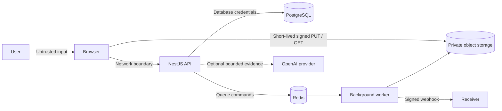

# OpsPilot v1.2 Threat Model

## Scope

This threat model covers the v1.2 web application, REST API, PostgreSQL database, Redis queues, private object storage, media worker, signed demo webhook flow and optional AI provider. It describes implemented controls and known boundaries; it is not a certification claim.

## Assets

- User identity and password hashes.
- Refresh sessions and access tokens.
- Workspace membership and role assignments.
- Event schedules, audience policy and operational content.
- Media metadata and processing state.
- Private source media and derivatives.
- Webhook signing secrets, delivery payloads and attempt history.
- Launch readiness evidence and state transitions.
- Actor-attributed audit history.
- Recommendation input/output snapshots, feature flags and error reports.

## Trust Boundaries

The browser, uploaded bytes and webhook destinations are untrusted. The API is the authorization boundary. PostgreSQL, Redis, object storage and application secrets belong on private runtime networks in deployment.

## Primary Threats and Controls

| Threat                      | v1.0 control                                                                         | Residual risk / next step                                                       |
| --------------------------- | ------------------------------------------------------------------------------------ | ------------------------------------------------------------------------------- |
| Credential theft            | Argon2 password hashes; passwords never returned                                     | Add account lockout and reset workflow before public registration               |
| Token theft through script  | HttpOnly cookies prevent direct JavaScript access                                    | XSS can still act as the user; maintain CSP and avoid unsafe HTML               |
| Refresh-token replay        | Server-side hash, expiry, rotation and revocation                                    | Add session-family reuse detection for a public deployment                      |
| CSRF                        | SameSite=Lax cookies and JSON API                                                    | Add explicit origin/CSRF token validation before cross-site integrations        |
| Broken object authorization | Every domain query includes workspace ownership                                      | Maintain integration tests for each new resource type                           |
| Resource enumeration        | Cross-workspace resources return 404                                                 | Timing differences are not explicitly normalised                                |
| Privilege escalation        | Global role guard plus route allow-lists                                             | Admin membership management is out of v1 scope                                  |
| Mass assignment             | Global whitelist and forbid-non-whitelisted validation                               | Keep DTOs explicit as new fields are added                                      |
| Injection                   | Prisma parameterisation and typed filters                                            | Raw SQL is limited to a constant health query                                   |
| Brute force / abuse         | Global request throttling                                                            | Add identity- and endpoint-specific limits in hosted environments               |
| Invalid launch transition   | API state machine and readiness hard blockers                                        | Add idempotency keys for repeated commands in v1.1                              |
| Audit tampering             | No audit update/delete endpoint; writes paired with transactions                     | Database administrators can still alter data; export to immutable storage later |
| Supply-chain vulnerability  | Lock file, CI audit and zero-vulnerability release check                             | Dependabot or Renovate should be enabled after remote publication               |
| Malicious media             | Size/MIME limits, workspace keys, ffprobe validation, codec and duration allow-lists | Add antivirus/content-disarm scanning before accepting real customer media      |
| Presigned URL abuse         | Ten-minute PUT URL, exact object key/type/size and completion HEAD validation        | Compromise within the TTL can still consume bandwidth; add per-user quotas      |
| Private media disclosure    | Private bucket and five-minute signed playback URLs                                  | Storage credentials or copied live URLs remain sensitive                        |
| Queue poisoning/replay      | Private Redis, typed jobs, persisted job identity and idempotent completion          | Authenticate/encrypt managed Redis and monitor unexpected job volume            |
| Webhook forgery/replay      | HMAC-SHA256, encrypted secret, event ID, timestamp and replay window                 | Rotate endpoint secrets and support dual-key rollover in a hosted release       |
| Duplicate webhook effects   | Unique delivery key and stable receiver idempotency key                              | Receivers remain responsible for durable idempotency                            |
| Webhook SSRF                | v1.1 only creates a server-generated local demo URL                                  | Add DNS/IP validation and outbound network policy before arbitrary URLs         |
| Sensitive data leakage      | Seed data is fictional and API responses are scoped                                  | Add field-level classification before real attendee data exists                 |
| AI data disclosure          | Only bounded event/readiness evidence is sent; API key stays server-side             | Review provider retention and UK GDPR terms before real customer data           |
| Ungrounded AI action        | Strict schema, evidence-key validation, feature flag and human confirmation          | Expand semantic evaluations before wider rollout                                |

## Authentication Details

- Access cookie lifetime: 15 minutes.
- Refresh cookie lifetime: 7 days.
- Refresh cookie path: `/api/v1/auth`.
- Cookies: HttpOnly, SameSite=Lax and Secure when `COOKIE_SECURE=true`.
- Refresh token: JWT plus an Argon2 hash in the `Session` table.
- Logout: current session revocation plus cookie clearing.
- Demo accounts: seeded credentials use the standard login endpoint and receive only their database-assigned workspace role.

Production launch requirements:

1. Set long random access and refresh secrets through a secret manager.
2. Set `COOKIE_SECURE=true` and terminate only through HTTPS.
3. Set a single trusted `WEB_ORIGIN`.
4. Remove seeded demo accounts or rotate their credentials outside an isolated portfolio deployment.
5. Rotate credentials after any suspected exposure.

## Authorization Matrix

| Capability                       | Admin | Operations manager | Content operator | Analyst | Viewer |
| -------------------------------- | :---: | :----------------: | :--------------: | :-----: | :----: |
| View workspace event data        |  Yes  |        Yes         |       Yes        |   Yes   |  Yes   |
| Create/update event              |  Yes  |        Yes         |        No        |   No    |   No   |
| Transition event state           |  Yes  |        Yes         |        No        |   No    |   No   |
| Configure access policy          |  Yes  |        Yes         |        No        |   No    |   No   |
| Update runbook                   |  Yes  |        Yes         |       Yes        |   No    |   No   |
| Manage content                   |  Yes  |        Yes         |       Yes        |   No    |   No   |
| Attach/retry media               |  Yes  |        Yes         |       Yes        |   No    |   No   |
| Upload media                     |  Yes  |        Yes         |       Yes        |   No    |   No   |
| Create/retry webhook integration |  Yes  |        Yes         |        No        |   No    |   No   |
| Generate/resolve recommendation  |  Yes  |        Yes         |        No        |   No    |   No   |
| Configure AI / confirm advisory  |  Yes  |        Yes         |        No        |   No    |   No   |
| View analytics / export CSV      |  Yes  |        Yes         |       Yes        |   Yes   |  Yes   |
| Refresh analytics / triage error |  Yes  |        Yes         |        No        |   No    |   No   |

Only operations manager and analyst are exposed in the v1 demo UI. The remaining roles are modelled for the roadmap and protected by API decorators where applicable.

## Browser Security Headers

Helmet supplies baseline headers including content-type sniffing protection, frame restrictions and a content security policy. The local Swagger UI requires inline script and style allowances. A hosted architecture should isolate developer documentation to an internal hostname or provide a nonce-based CSP for the product surface.

## Privacy

The v1.2 seed contains fictional users and operational records. User uploads in the local demo are private but remain data supplied by the operator; the default retention worker removes non-seeded demo media after 24 hours. No attendee identities exist. The no-key demo stores deterministic recommendation snapshots but sends no data to an external AI provider.

Before real users or attendees:

- document retention and deletion periods;
- add a data-subject request workflow;
- classify audit and event fields;
- minimise registration fields by purpose;
- define processor and subprocessor boundaries;
- review UK GDPR lawful basis and consent language with qualified counsel.

## Security Verification

Automated evidence in v1.2:

- unauthenticated event request returns 401;
- analyst write attempts return 403;
- a valid event from another workspace returns 404;
- validation rejects unknown request properties;
- illegal state transitions are rejected;
- production dependency audit reports zero known vulnerabilities.
- media MIME/kind, duration and actual codec validation tests pass;
- webhook signatures reject payload tampering and retry delays are bounded;
- Integration Centre creation and retry routes enforce role permissions;
- readiness checks cover PostgreSQL, object storage and Redis queues.
- AI contract fixtures reject unsupported and ungrounded output;
- analyst attempts to change flags, refresh analytics or triage errors return 403.

## Out of Scope

- Public user registration, invitations and password reset.
- Billing or payment data.
- Real attendee identity and analytics.
- Arbitrary third-party webhook URLs, OAuth integrations and secret rotation UI.
- Malware scanning, DRM and public customer media ingestion.
- Multi-region infrastructure and disaster recovery.

These are not assumed safe by omission; each requires an updated threat model when introduced.
